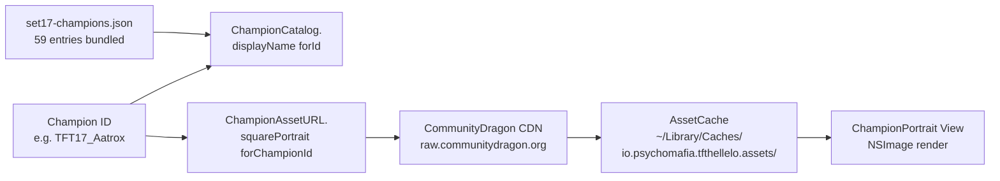

# Asset Pipeline Architecture — TFT Hell Elo

Last updated: 2026-04-26
Phase: phase-01-champion-portraits

---

## Overview

The asset pipeline resolves TFT Set 17 champion identifiers (e.g. `TFT17_Aatrox`) into rendered portrait images inside the macOS app. It stitches together a bundled JSON catalog (display names + ID validity), a pure URL builder targeting CommunityDragon's CDN, and a disk-backed `AssetCache` that fetches lazily on first render. No assets ship in the app bundle — everything is fetched on demand and persisted to `~/Library/Caches/`.

---

## Flow diagram



---

## Components

| Component | File | Role |
|-----------|------|------|
| `ChampionCatalog` | `App/TFTMac/Generated/ChampionCatalog.swift` | Data-driven `displayName(forId:)` lookup, populated at app launch from bundled JSON. |
| `set17-champions.json` | `App/TFTMac/Resources/set17-champions.json` | 59 Set 17 champion IDs + curated display names (e.g. Kai'Sa, Bel'Veth, Cho'Gath). |
| `ChampionAssetURL` | `App/TFTMac/Services/ChampionAssetURL.swift` | Pure URL builder — no IO. Produces CommunityDragon CDN URL from champion ID. |
| `AssetCache` | `App/TFTMac/Services/AssetCache.swift` | URLSession + disk cache. SHA-256(url) → filename. 30-day TTL via mtime. 50MB ceiling LRU eviction. |
| `ChampionPortrait` | `App/TFTMac/Views/ChampionPortrait.swift` | SwiftUI view. Async `.task` triggers `AssetCache` load. Falls back to cost-colored circle on miss. |

---

## URL pattern

CommunityDragon hosts TFT Set 17 portraits under a deterministic path. Pattern (from research):

```
https://raw.communitydragon.org/latest/game/assets/characters/
  tft17_{lowercase_id}/hud/tft17_{lowercase_id}_square.tft_set17.png
```

Example:
- `TFT17_Aatrox` → `https://raw.communitydragon.org/latest/game/assets/characters/tft17_aatrox/hud/tft17_aatrox_square.tft_set17.png`

Reference: `plans/260426-1752-tftactics-feature-parity/research/communitydragon-set17.md` for endpoint discovery + 200-status verification across the 59-champion sample.

---

## Cache strategy

**Disk location:** `~/Library/Caches/io.psychomafia.tfthellelo.assets/`

**Filename:** `SHA256(url).png` — content-addressed, collision-free. Avoids encoding URL path into filename (which would break on slashes / Windows portability concerns moot but pattern preserved).

**TTL:** 30 days, enforced via filesystem `mtime`. On read:
- If file exists AND `now - mtime < 30 days` → cache hit, return data.
- If file exists AND stale → treat as miss, re-fetch, overwrite mtime.
- If file missing → fetch, write, return.

**Eviction:** 50MB ceiling. On write, if total cache size exceeds 50MB, delete least-recently-used files (sorted by `atime` ascending) until under ceiling. Worked example: 59 portraits × ~25KB each ≈ 1.5MB — well under ceiling for v0.1, headroom for traits/items in later phases.

**Concurrency:** `AssetCache` is a `final class` with internal serial queue around disk writes. URLSession handles network concurrency natively. Multiple `ChampionPortrait` views requesting the same URL will each hit the disk cache once it lands; no in-flight dedup yet (acceptable — CDN handles burst, and `URLSession` connection reuse amortizes).

---

## Fallback chain

When `ChampionPortrait` requests an image:

1. **Cache hit (fresh)** — disk file present, mtime within 30 days → return decoded `NSImage`.
2. **Cache miss → CDN fetch** — `URLSession` GET with 10s timeout. On 200 + valid PNG bytes → write to disk, return image.
3. **Network failure** (timeout, offline, DNS failure) — `AssetCache` returns `nil`. View renders cost-colored placeholder circle (existing v0.2 visual).
4. **HTTP 4xx / 5xx** — treated identically to network failure. Returns `nil`. No retry, no negative-cache (next render attempt will re-try the CDN — acceptable for v0.1; revisit if 404s become persistent).
5. **Decode failure** (corrupted bytes, non-PNG response) — returns `nil`, falls back to placeholder.

The placeholder is intentional: cost-colored circle communicates tier-cost without portrait, so a CDN outage degrades gracefully rather than blanking the UI.

---

## Failure modes

| Failure | Symptom | Behavior | Recovery |
|---------|---------|----------|----------|
| Offline | All portrait fetches fail | Cost circles render for all champs | First online launch backfills cache |
| CDN down (5xx) | New champion IDs fail to render | Cost circles for affected IDs | Next render attempt re-tries (no negative cache) |
| 404 on champion ID | Specific champ never resolves | Cost circle persists | Investigate URL pattern drift; update `ChampionAssetURL` builder |
| Malformed `set17-champions.json` | Catalog load fails at app launch | `displayName(forId:)` returns nil, view shows raw ID | Bundle regression test (`ChampionCatalogDataDrivenTests`) catches before ship |
| Cache dir permissions | Cache writes silently fail | Every render is a CDN fetch (slow, bandwidth waste) | Catch by `AssetCache` write error logging (future telemetry) |
| Cache exceeds 50MB | LRU eviction kicks in | Cold-cache portraits re-fetched | Expected behavior; tune ceiling if hit-rate degrades |

---

## Why no asset bundling

Decision: lazy-fetch from CDN, do NOT bundle portrait PNGs in the .app.

**Rationale:**
- Bundle size discipline — 59 portraits × 25KB = 1.5MB; plus future traits + items + augments would push toward 10MB+. v0.1 .app stays <5MB.
- Set 17 art mid-patch updates — Riot occasionally re-skins portraits. CDN-pulled images stay fresh without app update.
- 30-day cache means each user fetches once per portrait, then offline-capable for a month. Acceptable tradeoff for KISS.

**Tradeoff:** first-launch online requirement to populate cache. For v0.1 founder dogfood + 9 testers, all on stable home internet — non-issue. Re-evaluate if shipping wider.

---

## Cross-references

- Phase plan: `plans/260426-1752-tftactics-feature-parity/`
- Research report: `plans/260426-1752-tftactics-feature-parity/research/communitydragon-set17.md`
- Bug #004 (aggregator metadata): `docs/bugs-log.md`
- Bug #C1 (tier threshold tuning): `docs/bugs-log.md`
- Overall architecture: `docs/system-architecture.md`
- Changelog entry: `docs/project-changelog.md` § `[phase-01-champion-portraits]`
