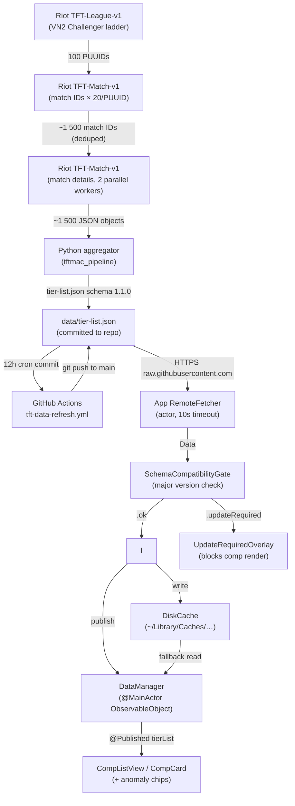

# Data Pipeline Architecture

**TFT Hell Elo — data pipeline deep-dive**
Last updated: 2026-04-25 | Schema: 1.1.0 | Phase: data-pipeline-real-riot

---

## Overview

The pipeline replaces a static bundled JSON with live VN2 Challenger match data refreshed every 12 hours. A Python aggregator fetches ranked TFT matches from Riot's Match-v5 API, groups compositions by similarity, scores them S/A/B/C, and emits a `tier-list.json`. GitHub Actions runs the aggregator on cron and commits the result. The macOS app fetches the JSON on launch and every 12 hours thereafter.

**Who uses it:** founder dogfood (v0.1). Not yet shipped to 9 testers.

**Why GitHub raw URL instead of CDN:** KISS — no third-party dependency. Latency 300–500 ms is acceptable for a background fetch.

---

## Architecture diagram



---

## Data flow walkthrough

Concrete example of one full 12-hour cycle:

1. **00:00 UTC** — GitHub Actions cron fires, Ubuntu runner starts.
2. **Checkout + install** — ~3 min. `pip install -e Pipeline/` installs `tftmac_pipeline`.
3. **Aggregator runs** — `python -m tftmac_pipeline.run_aggregator --region vn2 --output data/tier-list.json`
   - Fetches VN2 Challenger ladder: ~100 entries, each with a PUUID.
   - Per PUUID: fetches last 20 ranked (queue=1100) match IDs → ~2 000 IDs before dedup.
   - After dedup + cap at 1 500: fetches ~1 500 match details in parallel (2 workers).
   - Filters to queue_id=1100 post-fetch (belt-and-suspenders).
   - 1 500 matches × 8 participants = 12 000 participant slots processed.
4. **Aggregation** — comps grouped by Jaccard similarity (threshold 0.70). Each group scored → tier assigned. Top-3 anomalies per comp extracted.
5. **Emit** — `tier-list.json` written atomically (~50 KB). PII grep guard runs before commit.
6. **Commit** — `github-actions[bot]` commits `data: refresh tier-list.json [skip ci]` and pushes to main.
7. **App fetch on next launch** — `RemoteFetcher` fetches `https://raw.githubusercontent.com/.../data/tier-list.json` (~200 ms). `SchemaCompatibilityGate` checks version → `.ok` → `DiskCache` writes → `DataManager` publishes to UI.
8. **12h Timer** — fires while app is open; repeats step 7.

**Total cron wall time:** ~20 min (12 min fetch + 3 min setup + 1 min commit).
**App network cost:** 2 fetches/day × 50 KB = 100 KB/day = ~36 MB/year.

---

## Riot API integration

### Endpoints used

| Endpoint | Routing | Purpose |
|----------|---------|---------|
| `GET /tft/league/v1/challenger` | Platform (`vn2.api.riotgames.com`) | Challenger ladder → PUUIDs |
| `GET /tft/match/v1/matches/by-puuid/{puuid}/ids?count=20&queue=1100` | Regional (`sea.api.riotgames.com`) | Match IDs per PUUID |
| `GET /tft/match/v1/matches/{matchId}` | Regional (`sea.api.riotgames.com`) | Full match data |

**Platform routing:** VN2 → SEA regional. `riot_client.py` `PLATFORM_TO_REGIONAL` dict.

### Rate limit strategy

Dev key budget: 100 req / 2 min = 50 req/min sustained.

`AsyncLimiter(50, 60)` is the shared token bucket across 2 async workers:
- 50 tokens per 60 s (50% safety margin under the 100/120 s Dev budget).
- Both workers race for tokens; neither can exceed 50 req/min combined.
- Analogy: a coin dispenser with 50 coins that reloads every 60 s. Both workers spend from the same dispenser — they cannot overspend even if one is faster.

**1 500 matches at 50 req/min → ~20 min wall time** (matches fit within 30 min GHA soft budget).

### Error handling

| HTTP status | Action |
|-------------|--------|
| 401 / 403 | `RiotAuthError` raised → aggregator exits with code 2 → workflow fails → no commit |
| 429 | Exponential backoff 5 / 10 / 20 s, max 3 retries |
| 500–504 | Retry once after 3 s; skip on second failure |
| Connection timeout | Retry once; skip on second failure |
| Single match parse error | Log + skip; pipeline continues |
| 0 valid matches at end | Exit code 3 → workflow fails → last good JSON preserved |

**Atomicity invariant:** aggregator NEVER overwrites `data/tier-list.json` with empty or partial output. Exit code != 0 stops the workflow before the commit step.

### Dev key rotation runbook

Riot Dev keys auto-expire every 24 hours. Required daily:

1. Go to [https://developer.riotgames.com](https://developer.riotgames.com) → regenerate key.
2. Repo Settings → Secrets and variables → Actions → `RIOT_API_KEY` → update value.
3. Estimated time: ~2 min.

On failure: GitHub sends an email to `norway@lab3.asia` (Actions default failure notification). App falls back to last committed `data/tier-list.json` until next successful run.

---

## Aggregator algorithm

### Module layout

```
Pipeline/src/tftmac_pipeline/
├── riot_client.py        — async Riot API client (aiohttp + aiolimiter)
├── tier_calculator.py    — classify() pure function → S/A/B/C
├── anomaly_aggregator.py — TFT17_EkkoOffering_* per-comp aggregation
├── champion_aggregator.py — units → top-N champions per comp
├── comp_pipeline.py      — orchestrates grouping + aggregation
├── json_emitter.py       — dataclasses → JSON (deterministic, PII-safe)
├── run_aggregator.py     — CLI entrypoint (argparse + async main)
├── comp_grouping.py      — Jaccard-based comp grouping (existing)
├── comp_signature.py     — extract_signature() per participant (existing)
└── jaccard.py            — similarity metric (existing)
```

### Tier classification

Inputs per comp: `play_rate` (0–1), `avg_placement` (1–8), `sample_size`.

| Tier | play_rate | avg_placement | sample_size |
|------|-----------|---------------|-------------|
| **S** | >= 0.08 | <= 4.0 | >= 30 |
| **A** | >= 0.05 | <= 4.3 | >= 20 |
| **B** | >= 0.03 | <= 4.5 | >= 15 |
| **C** | else | else | >= 10 |
| *(filtered)* | — | — | < 10 |

Concrete example: 1 500 ranked matches × 8 participants = 12 000 slots. Comp "Storm Quickdraw" appears 960 times → play_rate = 960/12 000 = 0.08. If avg_placement = 3.9, sample_size = 960 → tier **S** (all thresholds pass at the boundary).

### Anomaly aggregation (Set 17 EkkoOffering mechanic)

Set 17 has no augments. The Anomaly mechanic appears as `TFT17_EkkoOffering_*` items in `units[].itemNames[]`.

Per comp group:
1. Scan all participants' `units[].itemNames[]` for `TFT17_EkkoOffering_*` prefix.
2. Count occurrences per anomaly_id.
3. `agreement = count / group.sample_size`.
4. Filter: agreement >= 0.40. Keep top-3 by agreement descending.
5. Emit `comps[].anomalies = [{id, agreement}, ...]`. Empty array if none qualify.

Concrete example: comp group has sample_size=100. `TFT17_EkkoOffering_AnomalyItem` appears in 71 participants → agreement = 0.71 → qualifies as top anomaly recommendation.

### Comp grouping

`group_signatures(threshold=0.70)` — Jaccard similarity on champion sets (cost >= 3 only). Two comp signatures are the same group if overlap / union >= 0.70.

`extract_signature()` — per participant, extracts champion IDs with cost >= 3.

---

## JSON schema (1.1.0)

Full spec. Canonical example: `Pipeline/tests/fixtures/expected-tier-list-output.json`.

```json
{
  "schema_version": "1.1.0",
  "patch_version": "16.8",
  "last_updated": "2026-04-25T18:00:00Z",
  "data_window_hours": 12,
  "elo_bracket": "CHALLENGER",
  "region": "VN2",
  "total_matches_sampled": 1247,
  "comps": [
    {
      "comp_id": "storm-quickdraw",
      "name": "Storm Quickdraw",
      "tier": "S",
      "play_rate": 0.105,
      "avg_placement": 3.78,
      "top_4_rate": 0.61,
      "sample_size": 131,
      "champions": [
        {
          "id": "TFT17_Viktor",
          "cost": 5,
          "is_carry": true,
          "items": [
            {"id": "TFT_Item_JeweledGauntlet", "agreement": 0.82}
          ]
        }
      ],
      "anomalies": [
        {"id": "TFT17_EkkoOffering_AnomalyItem", "agreement": 0.71}
      ]
    }
  ]
}
```

### Field semantics

| Field | Type | Notes |
|-------|------|-------|
| `schema_version` | string | Semver. App gate checks major only for compatibility. |
| `patch_version` | string | TFT game patch (informational). |
| `last_updated` | ISO8601 UTC | Time aggregator ran. |
| `data_window_hours` | int | Always 12 for v0.1 (single cron window). |
| `elo_bracket` | string | Always `"CHALLENGER"` for v0.1. |
| `region` | string | Always `"VN2"` for v0.1 (additive field over 1.0.0). |
| `total_matches_sampled` | int | Ranked matches processed. |
| `comps[].comp_id` | string | Kebab-case identifier derived from name. |
| `comps[].play_rate` | float 0–1 | Fraction of participant slots this comp occupied. |
| `comps[].avg_placement` | float 1–8 | Mean finish placement. Lower = better. |
| `comps[].top_4_rate` | float 0–1 | Fraction of appearances finishing 1st–4th. |
| `comps[].sample_size` | int | Observation count. < 10 filtered out entirely. |
| `comps[].champions[].is_carry` | bool | True when unit avg tier_current >= 2 (2-star+ signal). |
| `comps[].anomalies[].agreement` | float 0–1 | Fraction of comp appearances where this anomaly was present. |

**Schema versioning:** 1.1.0 is additive over 1.0.0 (`anomalies` + `region` fields added). Old app decodes 1.1.0 because Swift `Codable` ignores unknown fields. `Comp.anomalies` uses `decodeIfPresent ?? []` so old 1.0.0 JSON (no `anomalies` key) decodes to empty array without error.

---

## GitHub Actions workflow

File: `.github/workflows/tft-data-refresh.yml`

**Triggers:** `schedule: cron '0 */12 * * *'` (00:00 + 12:00 UTC) and `workflow_dispatch` (manual).

### Security defenses (public repo)

| Threat | Mitigation |
|--------|------------|
| Fork PR exfiltrates secrets | `on: schedule + workflow_dispatch` only; no `pull_request_target`. Fork PRs never receive secrets. |
| Forked repo runs our workflow | `if: github.repository == 'psychomafia-tiger/tft-hell-elo-for-macos'` repo guard on `refresh` job. |
| Workflow injection via PR title/body | Zero `${{ github.event.* }}` references in any `run:` block. |
| Compromised third-party action | All action references SHA-pinned (40-char hash, not tag). Only first-party `actions/checkout` + `actions/setup-python` used. |
| Secrets leaked in logs | Actions auto-redacts secret values. Aggregator logs status code only on HTTP errors, never response body. |
| Token over-permission | `permissions: contents: write` only. No `id-token`, `packages`, or `actions`. |
| PII leaking into commit | PII grep guard step before `git add`: rejects if `"puuid"`, `"riotIdGameName"`, or `RGAPI-` present in output JSON. |
| Third-party commit action risk | Hand-rolled 6-line bash `git add / commit / push` — no `stefanzweifel/git-auto-commit-action`. |

**SHA bump policy:** manual, monthly. Command to get current SHA:
```bash
gh api repos/actions/checkout/git/refs/tags/v4 --jq .object.sha
gh api repos/actions/setup-python/git/refs/tags/v5 --jq .object.sha
```

### Cron cadence math

730 runs/year × ~20 min/run = ~240 compute-hours/year. Public repo = unlimited free Actions minutes. No cost concern.

---

## App-side fetch chain

### Components

**`RemoteFetcher` (actor)** — fetches raw JSON from `https://raw.githubusercontent.com/psychomafia-tiger/tft-hell-elo-for-macos/main/data/tier-list.json`. 10 s timeout. Single retry after 3 s on any failure. `actor` isolation prevents data-race on concurrent fetch calls.

**`DiskCache` (struct)** — atomic read/write to `~/Library/Caches/io.psychomafia.tfthellelo/tier-list.json`. `.atomic` write option = crash-safe. Reads return `(Data, Date)` (content + mtime for age calculation).

**`SchemaCompatibilityGate` (struct)** — pure gate. `appSchema = SchemaVersion(major: 1, minor: 0, patch: 0)`. Accepts both bundled 1.0.0 and remote 1.1.0 (minor forward window). Rejects 2.0.0+ (breaking change).

**`DataManager` (@MainActor ObservableObject)** — orchestrates the fetch chain. `@Published var tierList` drives all comp views. `@Published var bannerState` drives the banner slot.

### Fetch chain decision flow

```
refresh()
    │
    ├─ RemoteFetcher.fetch()
    │       success → SchemaGate.check()
    │                   .ok         → DiskCache.write + publish + bannerState=.fresh
    │                   .updateReq  → bannerState=.updateRequired (STOP — don't render)
    │       failure ↓
    ├─ DiskCache.read()
    │       exists, age < 24h   → publish + bannerState=.lastUpdated(hoursAgo)
    │       exists, 24h–7d      → publish + bannerState=.staleData(daysAgo)
    │       missing / age > 7d  ↓
    └─ loadBundledJSON()         → publish + bannerState=.offlineBundled
```

### BannerState meanings

| State | UI | Example |
|-------|----|---------|
| `.fresh` | No banner | — |
| `.lastUpdated(3)` | Subtle grey bar | "Last updated 3h ago" |
| `.staleData(2)` | Amber bar | "Stale data — last updated 2d ago" |
| `.offlineBundled` | Orange bar | "Offline mode — using bundled data" |
| `.updateRequired` | Full-screen overlay | "Update Required — download latest .dmg" |

### 12h background poll

```swift
Timer.scheduledTimer(withTimeInterval: 12 * 60 * 60, repeats: true) { [weak self] _ in
    Task { @MainActor [weak self] in self?.scheduleRefresh() }
}
```

**Always fires — no idle skip.** Rationale: 12h × 50 KB = trivial network/battery cost. Idle detection (NSWorkspace observers, sleep/wake edge cases) violates KISS for negligible savings.

### DataManager lifecycle (MenuBarExtra)

`DataManager.init()` calls `start()` immediately — not deferred to `.onAppear`. Reason: `MenuBarExtra(.window)` window may never fire `.onAppear` if the user triggers the overlay via hotkey before the popover opens. Launch fetch must happen unconditionally.

---

## Performance characteristics

| Metric | Value |
|--------|-------|
| Cron run wall time | ~20 min (1 500 matches, 2 workers) |
| Output JSON size | ~50 KB gzipped |
| App fetch latency | ~200 ms on typical home network |
| URLSession timeout | 10 s (fail fast → fallback) |
| Background poll | Every 12 h |
| Annual network egress (app) | ~36 MB/year (2 fetches/day × 50 KB × 365) |
| Memory (aggregator) | < 100 MB (matches processed serially, not buffered in full) |
| GHA compute | ~240 h/year (well within public repo unlimited minutes) |

---

## Failure modes and runbooks

### Riot API key expired (24h rotation missed)

**Symptom:** GitHub Actions workflow fails with exit code 2. Red X in Actions UI. Email notification to `norway@lab3.asia`.

**Fix:**
1. Visit [https://developer.riotgames.com](https://developer.riotgames.com) → regenerate Dev key.
2. Repo Settings → Secrets → `RIOT_API_KEY` → update.
3. Actions tab → "TFT data refresh" → "Run workflow" (manual trigger to verify).

**App impact during gap:** Last committed `data/tier-list.json` served until next successful cron. App shows no banner if cached data < 24h old; "Last updated Xh ago" after 24h; "Stale data" after longer.

### Cron timeout or rate limit hit

**Symptom:** Workflow times out (> 30 min) or exits with code != 0 due to 429 storm.

**Fix:** Check Actions log. If rate limit: `AsyncLimiter` usually prevents this; if seen, reduce `--workers` to 1 in workflow invocation and re-trigger. If timeout: reduce `--max-matches` from 1500 to 500 for a lighter run.

### Aggregator emits empty/partial JSON

**Symptom:** Workflow fails at aggregator step (exit code 3: "Insufficient data"). No commit occurs.

**Protection:** Exit code != 0 stops workflow before commit step. Previous good `data/tier-list.json` is preserved untouched. App continues to serve the last committed version.

**Debugging:** Download workflow artifact logs. Check `total_matches_sampled` in last committed JSON. If VN2 Challenger has < 200 active players that week, sample may be small — lower tier thresholds or wait for more ranked games.

### App schema mismatch (UpdateRequired overlay)

**Symptom:** App shows "Update Required" full-screen overlay. Comps not rendered.

**Cause:** Remote JSON has `schema_version` with major version > 1 (breaking change). App schema gate rejects it.

**Fix:** Download latest `.dmg` from GitHub Releases. The overlay text says this explicitly.

**Note:** This should not occur in normal v0.1 operation. Only happens if the aggregator is intentionally bumped to schema 2.0.0 before app update is distributed.

### PII grep guard trips

**Symptom:** Workflow fails at "PII grep guard" step. Error: "PII or key fragment detected in JSON output — refusing to commit".

**Fix:** Check aggregator output (`/tmp/tier-list.json` from the failed run in logs). A bug is leaking a PUUID or RGAPI key fragment into the output. Fix `json_emitter.py` or the relevant aggregator module, re-run locally with `make smoke`, then push a fix and re-trigger workflow.

---

## Deferred to v0.2

- **Data-drift alerting** — PR distribution shift detection between consecutive runs. Deferred until shipping 9 testers. v0.1: founder is the QA in-session.
- **Git history bloat mitigation** — 730 commits/year from cron. Tracked as Bug #003 in `docs/bugs-log.md`. Re-evaluate at 6-month mark or repo size > 500 MB. Options: orphan branch, Git LFS, separate data repo.
- **SHA auto-bump tooling** (Renovate/Dependabot) — manual monthly bump for v0.1 KISS. Re-evaluate when shipping testers.
- **Multi-region pool** — VN2 only for v0.1. Expand to KR mix if VN2 sample size proves insufficient post-tester launch.
- **Manual refresh trigger** — architecture already supports it (`scheduleRefresh()` public), not wired to UI for v0.1 minimum.

---

## Cross-references

- Plan: `plans/260425-1817-data-pipeline-real-riot/plan.md`
- System architecture overview: `docs/system-architecture.md`
- Code-reviewer audit (4 critical findings): `plans/reports/code-reviewer-260425-1831-data-pipeline-arch-security.md`
- Phase 01 spec (aggregator): `plans/260425-1817-data-pipeline-real-riot/phase-01-python-aggregator.md`
- Phase 02 spec (GHA workflow): `plans/260425-1817-data-pipeline-real-riot/phase-02-github-actions-cron.md`
- Phase 03 spec (app fetch): `plans/260425-1817-data-pipeline-real-riot/phase-03-app-network-fetch.md`
- Bugs log: `docs/bugs-log.md` (Bug #003 — git history bloat)
- Canonical output fixture: `Pipeline/tests/fixtures/expected-tier-list-output.json`
