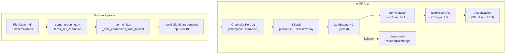

# Portrait Redesign Architecture (Phase 3)

Last updated: 2026-04-28

Phase 3 deep-dive: how `ChampionPortrait` evolved from "tier-color border on carry only + separate text items row" → "cost-color border always + 3-item overlay on carry" matching the TFTactics web reference.

## Why redesign

User reading time observed in dogfood: ~1.5–2s to parse 1 carry slot via the legacy text row format ("Illaoi → Gargoyle Stoneplate 49%"). TFTactics-style portrait reads in 0.3–0.5s — gamer (game player) muscle memory built around visual icons + cost colors.

## End-to-end flow

## Files added (vs Phase 2)

| File | Purpose |
|---|---|
| `App/TFTMac/Resources/set17-items.json` | 183 Set 17 items metadata (apiName → display + iconToken + itemClass) |
| `App/TFTMac/Services/ItemAssetURL.swift` | URL builder using verified CDragon pattern |
| `App/TFTMac/Views/ItemBadge.swift` | 12pt async badge + class-tint fallback |
| `Pipeline/scripts/generate-set17-items.py` | Auto-gen script from CDragon `en_us.json` |

## Files modified

| File | Change |
|---|---|
| `App/TFTMac/Views/ChampionPortrait.swift` | Cost border (always), items overlay on carry, removed `tierColor` param |
| `App/TFTMac/Generated/ItemCatalog.swift` | Hardcoded dict → bundled JSON load + `iconToken` + `itemClass` |
| `App/TFTMac/Views/CompCard.swift` | Removed `CompCardItemsRow` callsite |
| `App/TFTMac/Views/CompCardAnomaliesRow.swift` | Stale comment refs cleaned |
| `Pipeline/src/tftmac_pipeline/comp_grouping.py` | Read `unit.itemNames` (Bug #008) |

## Files removed

- `App/TFTMac/Views/CompCardItemsRow.swift` — legacy text format

## URL pattern (verified)

CommunityDragon item icon URL is derived from each item's `icon` field in `en_us.json`:

- Source field: `ASSETS/Maps/TFT/Icons/Items/Hexcore/TFT_Item_GargoyleStoneplate.TFT_Set13.tex`
- Conversion: take filename only → drop `.tex` → lowercase
- Token (bundled in `set17-items.json`): `tft_item_gargoylestoneplate.tft_set13`
- Final URL: `https://raw.communitydragon.org/latest/game/assets/maps/tft/icons/items/hexcore/<token>.png`

The set suffix (`.tft_set13`) reflects when Riot last refreshed the texture — NOT the active TFT set. Items reused across sets keep their original suffix. Preserve exactly as emitted by CDragon.

### Concrete example

Karma carry holding Jeweled Gauntlet:

- Pipeline emits: `items: [{ id: "TFT_Item_JeweledGauntlet", agreement: 0.62 }, ...]`
- Swift `ItemCatalog.lookup("TFT_Item_JeweledGauntlet")` → `(displayName: "Jeweled Gauntlet", iconToken: "tft_item_jeweledgauntlet.tft_set13", itemClass: .ap)`
- `ItemAssetURL.url(forToken: "tft_item_jeweledgauntlet.tft_set13")` → `https://raw.communitydragon.org/latest/game/assets/maps/tft/icons/items/hexcore/tft_item_jeweledgauntlet.tft_set13.png`
- `AssetCache.image(at: url)` → cache hit OR HTTPS fetch → 30d on-disk cache
- On 4xx/5xx/timeout: `ItemBadge` falls back to purple-tinted RoundedRectangle (itemClass=ap → `.purple`)

## itemClass fallback colors

| Class | Examples | Tint |
|---|---|---|
| tank | Gargoyle Stoneplate, Bramble Vest, Warmog's Armor | `.blue` |
| ad | Infinity Edge, Last Whisper, Bloodthirster | `.red` |
| ap | Jeweled Gauntlet, Rabadon's Deathcap, Archangel's Staff | `.purple` |
| utility | Statikk Shiv, Hand of Justice, Spear of Shojin | `.green` |
| unknown | catalog miss / new item / radiant variant not yet classified | `.gray` + "?" glyph |

Class chosen by manual `OVERRIDES` dict in `generate-set17-items.py` (~30 entries) + keyword heuristic on item description as fallback. Imperfect — anh manual review can patch any miscategorized common item via OVERRIDES dict, which auto-propagates next gen run.

Current ratio: ~80 of 183 items classify as `unknown` (radiant variants, support items, faction emblems Riot reuses across sets). Acceptable for v0.1 — real fallback shows colored square + glyph, not broken/missing tile.

## Cost-color convention

Replaces the previous tier-color (S/A/B/C) carry-only border with cost-color always:

| Cost | Color (hex) | UI Token |
|---|---|---|
| 1 | gray `#7F8C8D` | `Theme.Colors.cost1` |
| 2 | green `#2ECC71` | `Theme.Colors.cost2` |
| 3 | blue `#3498DB` | `Theme.Colors.cost3` |
| 4 | purple `#9B59B6` | `Theme.Colors.cost4` |
| 5 | gold `#F1C40F` | `Theme.Colors.cost5` |

Why: TFT canonical convention. Players already trained by 8+ seasons of in-game shop UI to associate cost-color with rarity. Tier-color was an app-only invention.

## Cross-references

- Spec: `docs/superpowers/specs/2026-04-27-tftactics-portrait-redesign-design.md`
- Plan: `plans/260427-2343-tftactics-portrait-redesign/plan.md`
- Sibling architectures: `docs/asset-pipeline-architecture.md` (Phase 1 portraits), `docs/trait-aggregation-architecture.md` (Phase 2 traits)
- Related bugs: #007 (cost: 0 — same producer/consumer parity class), #008 (items[] empty)
