# Positioning Hex Grid Architecture (Phase 4)

Last updated: 2026-04-30
Phase: 4 — Positioning Hex Grid (final TFTactics-parity feature for v0.1)
Schema bump: 1.2.0 → 1.4.0 (1.3.0 reserved / unshipped)

---

## Goal

Render a 4×7 hex board inside `ExpandedCardView` showing where each champion sits in the top comps. This is the last TFTactics-parity feature for the Champions tab.

## Constraint

Riot Match-v5 does **not** expose unit positions for Set 17. Verified 2026-04-29 against a 98-match KR fixture — `units[i]` keys are `[character_id, itemNames, name, rarity, tier]` only, 0/9 units have any `pos` / `position` / `boardPosition` field. Research note: `plans/260426-1752-tftactics-feature-parity/research/match-v5-positioning.md`.

→ Phase 4 ships a deterministic **rule-based fallback**. When Riot eventually surfaces positions, swap the aggregator implementation; the schema, model, and view layers stay unchanged.

---

## Data flow

```mermaid
flowchart LR
    M["Match-v5 participants\n(no pos field)"] --> CG["comp_grouping.py\nbuckets[trait_signature]"]
    CG --> EC["json_emitter.emit_comp"]
    CA["champion_aggregator\nchampions: [{id, cost, is_carry, ...}]"] --> EC
    EC --> PA["positioning_aggregator.aggregate_positions(\n  champions, traits)"]
    PA --> JSON["tier-list.json\ncomps[].positioning[]"]
    JSON -->|"Codable .convertFromSnakeCase"| POS["Position struct\n(championId, pos, frequency)"]
    POS --> COMP["Comp.positioning"]
    COMP --> EXP["ExpandedCardView"]
    EXP --> SECT["PositioningSection"]
    SECT --> HG["HexGridView"]
    HG --> CELL["HexCell × 28\n(via HexGeometry)"]
    CELL --> ASSET["AssetCache → CommunityDragon\n(only for occupied hexes)"]
```



## Hex grid convention

```
 col:  0   1   2   3   4   5   6
row 0: ⬡   ⬡   ⬡   ⬡   ⬡   ⬡   ⬡    ← backline (your side, far from enemy)
row 1:   ⬡   ⬡   ⬡   ⬡   ⬡   ⬡   ⬡  ← mid-back  (offset right by ½ hex)
row 2: ⬡   ⬡   ⬡   ⬡   ⬡   ⬡   ⬡    ← mid-front
row 3:   ⬡   ⬡   ⬡   ⬡   ⬡   ⬡   ⬡  ← frontline (closest to enemy)
```

`pos = row * 7 + col`. Range 0-27 (28 hexes). Pointy-top hexes; odd rows shift right by `hexSize / 2`. Vertical row spacing = `hexSize × √3/2 ≈ 0.866 × hexSize`.

## Rule-based assignment

`positioning_aggregator.aggregate_positions(champions, traits)` returns `[{championId, pos, frequency=1.0}]`. Algorithm:

1. **Classify archetype** from active comp traits (substring match on trait names):
   - `frontline_heavy` if any of `Tank`, `Melee`, `Brawler`, `Vanguard`, `Bastion`, `Bruiser`, `Warrior`, `Juggernaut`
   - `backline_heavy` if any of `Ranged`, `AP`, `AS`, `Mana`, `Sniper`, `Sorcerer`, `Marksman`, `Mage`, `Caster`
   - tie-break: frontline wins (tankier comps anchor harder around frontline placement)
   - default: `flex`

2. **Carry placement** (`is_carry=True`, sorted cost desc) → row 0 priority order `[3, 1, 5, 0, 6, 2, 4]` (center → wings → corners).

3. **Non-carry by cost bracket**:
   - cost 7+ (Blitzcrank-unique) → pos 24 (row 3 col 3, dead front)
   - cost 5 → row 0 corners (0, 6, 4, 2)
   - cost 4 → row 1 mid-back (8, 12, 7, 13)
   - cost 3 → archetype-driven: row 1 if `backline_heavy`, row 2 if `frontline_heavy`
   - cost 1-2 → row 3 frontline (22, 25, 23, 26, 24, 21, 27)

4. **Conflict resolution**: walk to next free hex (linear ±1, ±2…) starting from the slot's anchor.

5. **`frequency=1.0`** signals "rule-inferred" to consumers. When Riot ships `pos`, the function reverts to modal-frequency over top-4 placements and returns `<1.0`.

### Concrete example — "Storm Quickdraw"

- Champions (real fixture): Jhin (cost 4 carry), Senna (cost 4 carry), Kindred (cost 3), Caitlyn (cost 2), Maokai (cost 2), Ezreal (cost 1)
- Active traits: `Quickdraw` + `Storm` → no frontline/backline tokens → `flex`

Output:
| champion | pos | row | col | reason |
|----------|-----|-----|-----|--------|
| Jhin | 3 | 0 | 3 | 1st carry → center backline |
| Senna | 1 | 0 | 1 | 2nd carry → left wing backline |
| Kindred | 11 | 1 | 4 | cost 3 flex → row 1 (default backline_heavy slot) |
| Caitlyn | 22 | 3 | 1 | cost 2 → frontline left |
| Maokai | 25 | 3 | 4 | cost 2 → frontline right |
| Ezreal | 23 | 3 | 2 | cost 1 → next free in row 3 |

## Schema

```json
{
  "schema_version": "1.4.0",
  "comps": [
    {
      "comp_id": "...",
      "name": "...",
      "...": "...",
      "traits": [...],
      "positioning": [
        { "championId": "TFT17_Jhin",  "pos": 3, "frequency": 1.0 },
        { "championId": "TFT17_Senna", "pos": 1, "frequency": 1.0 }
      ]
    }
  ]
}
```

Forward-compat: app's `Comp.init(from:)` uses `decodeIfPresent ?? []`, so v1.0.0–v1.3.0 fixtures decode with `positioning = []` and the UI hides the section.

## Render layer

`HexGeometry` (pure functions in `HexCell.swift`):
- `center(row, col, hexSize)` → `CGPoint` for the hex center.
- `totalSize(rows, cols, hexSize)` → `CGSize`. Width includes a `hexSize/2` extension for odd-row offset.

`HexagonShape` — pointy-top 6-vertex `Path` inscribed in any `CGRect`.

`HexCell(championId:hexSize:)` — fills with `Theme.Colors.bgCard.opacity(0.4)`, strokes border, overlays the champion portrait clipped to a circle (70% of hexSize). Async-loads via `AssetCache` only when `championId` is non-nil. Tooltip via `.help()`.

`HexGridView(positioning:hexSize:)` — `ZStack(.topLeading)` with 28 `HexCell`s at fixed `.position()` from `HexGeometry.center`. Empty hexes still render (outline-only) so users see the full board at a glance.

`PositioningSection(positioning:)` — labeled wrapper for inclusion in `ExpandedCardView` (only shown when `comp.positioning` non-empty).

## Key tests

| Test | What it locks |
|------|---------------|
| `test_positioning_aggregator.test_no_position_collisions` | Two champions never share a hex. |
| `test_positioning_aggregator.test_first_carry_lands_center_backline` | Single carry → pos 3. |
| `test_positioning_aggregator.test_low_cost_units_go_frontline` | Cost 1-2 → row 3 (21-27). |
| `test_positioning_aggregator.test_frontline_heavy_pulls_cost3_to_front` | Tank trait → cost-3 in row 2. |
| `HexGridGeometryTests.test_centerForRow1Col0_oddRowShifted` | Odd-row offset math. |
| `HexGridGeometryTests.test_lastHexFitsInsideTotalSize` | (3, 6) center + radius ≤ totalSize. |
| `PositionDecodingTests.test_compForwardCompatMissingPositioning` | v1.2.0 JSON decodes with `positioning = []`. |
| `SampleTierListFixtureTests.testFixtureCompsHavePositioning` | Bundled fixture has positioning on ≥1 comp. |

## Limitations (acknowledged for v0.1)

- **Visual approximation**: real player boards differ. Cost-5 Karma (mage) and cost-5 Sett (tank) get the same row by cost since the pipeline lacks a per-champion trait map.
- **`frequency=1.0` everywhere** — currently pure heuristic. Roadmap: when Riot exposes positions, swap aggregator to modal-frequency aggregation; UI/schema unchanged.
- **No per-champion trait classification**: future v0.2 could ship a `set17-champion-traits.json` mapping champion→origin/class for tank/mage discrimination.

## Risk → Outcome

| Risk in plan | Outcome |
|--------------|---------|
| `pos` field absent in Match-v5 | Confirmed absent → fallback path implemented (Plan estimate +4-6h; actual closer to plan since the heuristic stayed simple). |
| Hex math off-by-one (row direction flip) | Pinned by `HexGridGeometryTests` — row 0 is your backline (top of grid), row 3 frontline (bottom). |
| Performance — 60 comps × 28 hexes | Mitigated: `HexCell` only async-loads images for occupied hexes; SwiftUI lazy in scroll context; empty hexes render outline-only. |

## Cross-references

- Research: `plans/260426-1752-tftactics-feature-parity/research/match-v5-positioning.md`
- Plan: `plans/260426-1752-tftactics-feature-parity/phase-04-positioning-hex-grid.md`
- Aggregator: `Pipeline/src/tftmac_pipeline/positioning_aggregator.py`
- View: `App/TFTMac/Views/HexCell.swift`, `App/TFTMac/Views/HexGridView.swift`
- Model: `App/TFTMac/Models/Position.swift`
- Schema constant: `Pipeline/src/tftmac_pipeline/json_emitter.py` `SCHEMA_VERSION = "1.4.0"`
