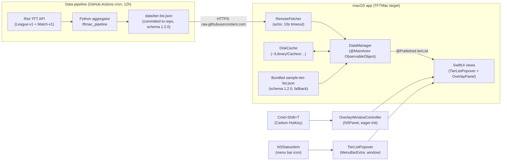
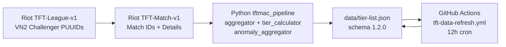

# System Architecture — TFT Hell Elo

Last updated: 2026-04-27

---

## Overview

TFT Hell Elo is a native macOS menu bar app (`MenuBarExtra(.window)`) that displays a live TFT tier list for VN2 Challenger. The system has two independent layers: a **data pipeline** (Python + GitHub Actions) that produces a JSON file every 12 hours, and a **macOS app** (SwiftUI/AppKit) that fetches and renders that JSON.

---

## High-level architecture



---

## App component map

### Entry point — `TFTMacApp` (`@main`)

- Creates `DataManager` as `@StateObject` (wraps it via `_dataManager = StateObject(wrappedValue:)` for eager init).
- Holds `HotkeyRegistrar` as stored property (Carbon binding must live for app lifetime).
- Eager-inits `OverlayWindowController` with the same `DataManager` instance for live updates.
- `MenuBarExtra(.window)` scene: `TierListPopover` receives `DataManager` via `.environmentObject(dataManager)`.

### Data layer

| Component | File | Role |
|-----------|------|------|
| `DataManager` | `Services/DataManager.swift` | `@MainActor ObservableObject`; orchestrates fetch chain; `@Published tierList` + `bannerState` |
| `RemoteFetcher` | `Services/RemoteFetcher.swift` | `actor`; HTTPS fetch with 10s timeout + 1 retry |
| `DiskCache` | `Services/DiskCache.swift` | Atomic read/write to `~/Library/Caches/io.psychomafia.tfthellelo/tier-list.json` |
| `SchemaCompatibilityGate` | `Services/SchemaCompatibilityGate.swift` | Pure gate: `.ok` or `.updateRequired` based on major schema version |
| `AssetCache` | `Services/AssetCache.swift` | URLSession + disk cache (~/Library/Caches/io.psychomafia.tfthellelo.assets/); 30-day TTL via mtime; 50MB LRU; SHA-256 URL→filename. Returns nil on 4xx/5xx/timeout for graceful UI fallback. |
| `ChampionAssetURL` | `Services/ChampionAssetURL.swift` | Pure URL builder for CommunityDragon Set 17 portraits. Pattern: `tft17_{lower}/hud/tft17_{lower}_square.tft_set17.png`. |
| `ChampionCatalog` | `Generated/ChampionCatalog.swift` | Data-driven from bundled `Resources/set17-champions.json` (59 entries). `displayName(forId:)` lookup. |

**Fetch chain priority (refresh()):**
1. `RemoteFetcher` → schema gate → cache write → publish `.fresh`
2. Cache (< 24h) → publish `.lastUpdated(hoursAgo)`
3. Cache (24h–7d) → publish `.staleData(daysAgo)`
4. Bundled JSON → publish `.offlineBundled`
5. Schema major mismatch at any step → `bannerState = .updateRequired`

### Model layer (`App/TFTMac/Models/`)

| Model | Notes |
|-------|-------|
| `TierList` | Root decode target. Contains `schemaVersion`, `region`, `comps[]`. |
| `Comp` | Per-comp stats + `champions[]` + `anomalies[]`. Custom `init(from:)` with `decodeIfPresent ?? []` for anomalies (forward-compat). |
| `Champion` | `id`, `cost`, `isCarry`, `items[]`. |
| `Anomaly` | `id` (TFT17_EkkoOffering_* string), `agreement` (0–1). |
| `SchemaVersion` | `isCompatible(with:)` — major match + minor within 10-window. |

### View layer (`App/TFTMac/Views/`)

| View | Role |
|------|------|
| `TierListPopover` | Root MenuBarExtra view. Reads `@EnvironmentObject DataManager`. |
| `CompListView` | Scrollable comp list. Renders `BannerBar` + `UpdateRequiredOverlay`. |
| `CompCard` (`CompCardV2`) | Per-comp card: header row + `CompCardItemsRow` + `CompCardAnomaliesRow`. |
| `ChampionPortrait` | Renders Set 17 champion artwork via `AssetCache` async load (`.task` modifier). Falls back to cost-colored placeholder circle on cache miss / load failure. |
| `CompCardAnomaliesRow` | Chip row for Set 17 EkkoOffering anomaly recommendations. Hidden when empty. |
| `UpdateRequiredOverlay` | Full-screen overlay when `bannerState == .updateRequired`. |
| `OverlayWindowController` | NSPanel lifecycle owner (eager-init for < 50ms first-show). |
| `OverlayPanel` | AppKit `NSPanel` hosting the overlay SwiftUI tree. |

### Hotkey subsystem

- `HotkeyRegistrar` (`Services/HotkeyRegistrar.swift`) — Carbon `RegisterEventHotKey` binding for Cmd+Shift+T.
- Toggles `OverlayWindowController.toggle()` on fire.
- **Limitation (Bug #002):** Carbon HotKey does not fire when TFT is in native macOS fullscreen mode. Workaround: use TFT borderless fullscreen. Permanent fix deferred to Phase 2.
- **TCC cdhash (Bug #001):** Each `xcodebuild` adhoc rebuild invalidates the Accessibility permission. After rebuild, re-grant in System Settings → Privacy → Accessibility.

---

## Data pipeline layer

See `docs/data-pipeline-architecture.md` for the full deep-dive.

### Summary



- **Aggregator:** `Pipeline/src/tftmac_pipeline/` — 8 modules. Trait-combo-signature comp grouping (Phase 2), S/A/B/C tier classification, EkkoOffering anomaly aggregation. Legacy Jaccard path (`comp_pipeline.run_pipeline`) retained but unused by `build_tier_list_payload`.
- **Workflow:** `.github/workflows/tft-data-refresh.yml` — SHA-pinned, repo guard, PII grep guard, hand-rolled commit. Designed for public repo safety.
- **Schema:** 1.2.0 (additive over 1.1.0 — adds `comp.traits[]` array). App uses forward-compat decoder; `appSchema = 1.0.0` in `SchemaCompatibilityGate` so bundled (1.2.0) + legacy remote (1.0.0/1.1.0) all pass the gate.

---

## macOS permissions

| Permission | Why needed | Dev runbook |
|------------|-----------|-------------|
| Accessibility | Carbon HotKey global intercept (Cmd+Shift+T) | After each `xcodebuild` rebuild, re-grant in System Settings → Privacy → Accessibility (Bug #001 — TCC cdhash invalidation). |
| Network (outbound) | `RemoteFetcher` HTTPS to `raw.githubusercontent.com` | No entitlement needed; ATS-enforced by default. |
| App Sandbox | Not sandboxed (v0.1 adhoc-signed) | `DiskCache` writes to `~/Library/Caches/` freely. |

---

## Key constraints and decisions

| Decision | Choice | Rationale |
|----------|--------|-----------|
| Distribution | Unsigned `.dmg`, GitHub Releases | Simplest for v0.1 founder dogfood. No notarization. |
| Data source | `raw.githubusercontent.com` (no CDN) | KISS. No third-party dependency. 300–500 ms latency acceptable. |
| Hotkey | Cmd+Shift+T via Carbon | Reliable background intercept in borderless/windowed mode. |
| Fullscreen overlay | Deferred to Phase 2 | Native fullscreen blocks Carbon HotKey (Bug #002). Borderless sufficient for v0.1. |
| Analytics | PostHog opt-in | Deferred; not yet wired. Primary KPI tracked manually by founder. |
| Code target name | `TFTMac` (retained) | Renaming breaks `@testable import TFTMac` in 5+ test files and XCUITest hardcoded refs. User-facing name = "TFT Hell Elo". |

---

## File layout (key paths)

```
App/TFTMac/
├── TFTMacApp.swift                — @main entry point
├── Services/
│   ├── DataManager.swift          — fetch orchestrator, @Published state
│   ├── RemoteFetcher.swift        — HTTPS actor
│   ├── DiskCache.swift            — file-backed cache
│   ├── SchemaCompatibilityGate.swift
│   ├── AssetCache.swift           — URLSession + disk cache for portraits (30d TTL, 50MB LRU)
│   └── ChampionAssetURL.swift     — CommunityDragon Set 17 portrait URL builder
├── Generated/
│   ├── ChampionCatalog.swift      — data-driven displayName lookup (loads bundled JSON)
│   ├── TraitCatalog.swift         — Set 17 trait apiName → display + iconToken (Phase 2)
│   └── TraitAssetURL.swift        — CommunityDragon trait icon URL builder
├── Models/
│   ├── TierList.swift
│   ├── Comp.swift                 — forward-compat anomalies + traits decoder
│   ├── Champion.swift
│   ├── Anomaly.swift
│   ├── TraitActivation.swift      — Phase 2 (name + count + tier_current)
│   └── SchemaVersion.swift
├── Views/
│   ├── TierListPopover.swift
│   ├── CompListView.swift
│   ├── CompCard.swift             — Phase 2: trait chips row
│   ├── ChampionPortrait.swift     — async portrait render via AssetCache
│   ├── TraitChip.swift            — Phase 2 trait badge with async icon
│   ├── CompCardAnomaliesRow.swift
│   ├── UpdateRequiredOverlay.swift
│   └── OverlayWindowController.swift
└── Resources/
    ├── sample-tier-list.json      — bundled fallback (schema 1.2.0)
    ├── set17-champions.json       — 59 Set 17 champion IDs + display names
    └── set17-traits.json          — 38 Set 17 traits (apiName → displayName + iconToken)

Pipeline/src/tftmac_pipeline/
├── riot_client.py                 — async Riot API client
├── tier_calculator.py             — S/A/B/C classify()
├── anomaly_aggregator.py
├── champion_aggregator.py
├── comp_pipeline.py               — legacy Jaccard path (retained, unused by build_tier_list_payload)
├── comp_grouping.py               — Phase 2 trait-combo-signature grouping
├── comp_name_resolver.py          — Phase 2 curated trait combo → semantic name
├── json_emitter.py                — Phase 2: emits comp.traits[] + schema 1.2.0
└── run_aggregator.py              — CLI entrypoint + build_tier_list_payload

Pipeline/data/
└── trait_name_map.json            — curated trait combo → semantic comp name (~6 entries)

.github/workflows/
└── tft-data-refresh.yml           — 12h cron, public-repo defensive design

data/
└── tier-list.json                 — live data (overwritten by cron)
```

---

## Cross-references

- Data pipeline deep-dive: `docs/data-pipeline-architecture.md`
- Asset pipeline deep-dive (Phase 1): `docs/asset-pipeline-architecture.md`
- Trait aggregation deep-dive (Phase 2): `docs/trait-aggregation-architecture.md`
- v0.1 design spec: `docs/design-v0.1-menu-bar-popover.md`
- Naming conventions: `docs/naming-conventions.md`
- Bugs log: `docs/bugs-log.md`
- Changelog: `docs/project-changelog.md`
