# Trait Aggregation Architecture (Phase 2)

Last updated: 2026-04-27

Phase 2 deep-dive: how comps are now identified, grouped, named, and rendered with **trait combo signatures** instead of the Phase 1 Jaccard-on-champion-set approach. Output schema bumps `1.1.0 → 1.2.0` (additive — existing decoders still work).

---

## Why trait grouping replaced Jaccard

Phase 1 grouped participants by Jaccard similarity over their final 8-unit roster. Two players running "Storm Quickdraw" with one filler unit difference were counted as different comps. Trait combo (e.g. `(Storm:4, Quickdraw:3)`) is the **player's intent** — fillers vary, traits don't. Result: ~40-80 buckets instead of hundreds, each with denser sample size and clearer naming.

**Concrete numerical example**: KR fixture (82 ranked matches × 8 = 656 participant slots). Old Jaccard path emitted ~10 comps after threshold filtering. New trait-signature path emits ~32 buckets at `min_sample=3` (relaxed for small fixture demo), or 1 bucket at production `min_sample=10`.

---

## End-to-end flow

```mermaid
flowchart LR
    subgraph pipeline ["Python Pipeline (tftmac_pipeline)"]
        M["Riot Match-v5<br/>matches[]"] --> P["_flatten_participants<br/>(participants[])"]
        P --> S["trait_combo_signature<br/>per participant<br/>= sorted tuple of<br/>(name, tier_current)"]
        S --> G["group_comps_by_trait_signature<br/>~40-80 buckets"]
        G --> F{"sample_size<br/>≥ MIN_SAMPLE?"}
        F -->|"no"| X["discard"]
        F -->|"yes"| N["resolve_comp_name<br/>(curated map<br/>+ fallback)"]
        N --> EM["emit_comp<br/>+ aggregate_champions"]
        EM --> CL["classify(tier)<br/>S/A/B/C"]
        CL --> J["TierList JSON<br/>schema 1.2.0"]
    end
    subgraph swift ["macOS App (SwiftUI)"]
        J --> D["Comp.decode<br/>(forward-compat:<br/>traits[] = [] for<br/>v1.0.0/1.1.0)"]
        D --> CC["CompCard.body"]
        CC --> TC["TraitChip × N"]
        TC --> TR["TraitCatalog<br/>(38 Set 17 traits)"]
        TR --> CD["CDragon icon URL<br/>trait_icon_17_*.tft_set17.png"]
        CD --> AC["AssetCache<br/>(30d disk + LRU)"]
    end
```



---

## Pipeline modules added in Phase 2

| Module | Purpose |
|---|---|
| `comp_grouping.py` | `group_comps_by_trait_signature(participants)` — single source of truth for trait-based bucketing. Coexists with legacy Jaccard `group_signatures` (unused). |
| `comp_name_resolver.py` | `resolve_comp_name(sig_tuple)` — looks up `Pipeline/data/trait_name_map.json` for human-readable name; falls back to top-2 trait apiNames stripped of `TFT17_` / `Set17_` prefix. |
| `json_emitter.py` (modified) | `emit_comp(bucket, name)` returns Schema 1.2.0 dict. New field `traits: [{name, count, tier_current}, ...]`. New helper `_emit_champions_from_bucket` for trait-bucket champion emission (pending: cost enrichment — Phase 3). |
| `run_aggregator.py` (modified) | `build_tier_list_payload` rewires to use trait grouping. Iterates buckets, calls `resolve_comp_name`, emits comps, computes `play_rate = bucket.sample_size / total_participants`, classifies tier. |

---

## Swift modules added in Phase 2

| File | Purpose |
|---|---|
| `Models/TraitActivation.swift` | `struct TraitActivation: Codable` — `name: String`, `count: Int`, `tierCurrent: Int`. Decoded from each entry in `comp.traits[]`. |
| `Models/Comp.swift` (modified) | Adds `let traits: [TraitActivation]` with forward-compat `decodeIfPresent ?? []` so v1.0.0/1.1.0 fixtures decode without error. |
| `Generated/TraitCatalog.swift` | Loads `set17-traits.json` at startup. Maps `apiName → (displayName, iconToken)`. Source: CommunityDragon `cdragon/tft/en_us.json` `data['sets']['17']['traits']`. |
| `Generated/TraitAssetURL.swift` | URL builder: `https://raw.communitydragon.org/latest/game/assets/ux/traiticons/trait_icon_17_<token>.tft_set17.png`. Note `.tft_set17.png` suffix (verified by CDN probe — naïve `.png` fails). |
| `Views/TraitChip.swift` | Async-loading badge: count number + icon (16pt) + display name. Uses `AssetCache` + `Theme.Fonts.monoCaption`. Falls back to text-only if catalog miss. |
| `Views/CompCard.swift` (modified) | Renders `traitsRow` between `topRow` and `championsRow`. Hidden when `comp.traits` is empty. Sorted by activation count descending. |

---

## Critical discoveries during implementation

1. **Real Riot API uses `TFT17_*` prefix, NOT `Set17_*`** — KR fixture surfaced this in T4 smoke test. Resolver regex `^(Set|TFT)\d+_` future-proofs Set 18+. Memory: `project_riot_trait_prefix_TFT17`.

2. **apiName ≠ icon token ≠ display name** — three distinct strings per trait:
   - apiName: `TFT17_PsyOps`, `TFT17_APTrait`, `TFT17_VexUniqueTrait`
   - displayName: "Psionic", "Replicator", "Doomer"
   - iconToken: `psyops`, `replicator`, `doomer`
   - Naïve prefix-strip fallback shows "PsyOps", "APTrait", "VexUniqueTrait" — all wrong. Catalog mandatory.

3. **Curated `trait_name_map.json` keys may MISS on real data** — current keys use semantic apiNames like `TFT17_Psionic+TFT17_Conduit`, but real Riot API emits `TFT17_PsyOps`. Fallback → display = top-2 apiNames stripped. Phase 3 action item: regenerate curated keys from real apiNames.

4. **Schema 1.2.0 forward-compat verified** — three test paths covered: v1.0.0 bundled (Phase 1), v1.1.0 transitional (cron output), v1.2.0 trait-aware (current). All decode via `decodeIfPresent ?? []` on `traits[]` and `anomalies[]`.

---

## Schema 1.2.0 example (one comp, abbreviated)

```json
{
  "comp_id": "trait-sig-3a7f",
  "name": "APTrait DarkStar",
  "tier": "C",
  "play_rate": 0.0228,
  "avg_placement": 4.40,
  "sample_size": 15,
  "traits": [
    {"name": "TFT17_DarkStar",  "count": 4, "tier_current": 2},
    {"name": "TFT17_APTrait",   "count": 3, "tier_current": 1},
    {"name": "TFT17_FlexTrait", "count": 2, "tier_current": 1}
  ],
  "champions": [
    {"id": "TFT17_Viktor", "cost": 5, "is_carry": true, "items": [...]}
  ],
  "anomalies": []
}
```

---

## Pending follow-ups (Phase 3)

| # | Task | Where |
|---|---|---|
| 1 | Regenerate `trait_name_map.json` keys from real apiNames | `Pipeline/data/trait_name_map.json` |
| 2 | Champion `cost` enrichment in `_emit_champions_from_bucket` (currently 0) | `Pipeline/src/tftmac_pipeline/json_emitter.py` |
| 3 | `tft17_rhaast` portrait 404 (CDragon asset gap) | external |
| 4 | Cleanup legacy Jaccard `comp_pipeline.run_pipeline` (unused) | `Pipeline/src/tftmac_pipeline/comp_pipeline.py` |
| 5 | `generate_golden_fixture.py` still hardcodes schema `1.1.0` | `Pipeline/tests/generate_golden_fixture.py` |

---

## Cross-references

- Phase 2 plan: `plans/260426-1752-tftactics-feature-parity/phase-02-trait-centric-comp.md`
- Sibling architecture: `docs/data-pipeline-architecture.md` (overall pipeline), `docs/asset-pipeline-architecture.md` (Phase 1 portraits)
- Bugs surfaced: `docs/bugs-log.md` (Bug #005 star_level)
- Changelog: `docs/project-changelog.md`
