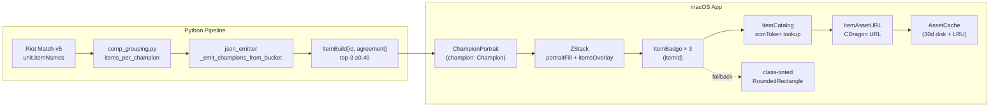

# Phase 4 — Cleanup + Docs Sync

**Status:** ⏳ Pending
**Estimate:** ~20 min
**Depends on:** Phase 3 complete

## Context

Remove the legacy `CompCardItemsRow` (text row "Illaoi → Gargoyle Stoneplate 49%") that the new portrait overlay replaces, fix stale comment references, and run the CLAUDE.md-mandated Phase Completion Protocol (changelog, bugs-log, system-architecture, deep-dive doc).

## Files

- Delete: `App/TFTMac/Views/CompCardItemsRow.swift`
- Modify: `App/TFTMac/Views/CompCard.swift:45` (remove `CompCardItemsRow(comp:)` line)
- Modify: `App/TFTMac/Views/CompCardAnomaliesRow.swift:5,12` (stale comment refs)
- Modify: `docs/system-architecture.md` (note items overlay path)
- Modify: `docs/project-changelog.md` (APPEND phase-03 entry)
- Modify: `docs/bugs-log.md` (APPEND #008 entry)
- Create: `docs/portrait-redesign-architecture.md` (deep-dive per protocol)

## Tasks

### Task 4.1: Remove CompCardItemsRow

- [ ] **Step 1: Remove callsite from CompCard.body**

Edit `App/TFTMac/Views/CompCard.swift:45` — remove the line:
```swift
            CompCardItemsRow(comp: comp)
```

- [ ] **Step 2: Delete the file from disk**

Run:
```bash
rm App/TFTMac/Views/CompCardItemsRow.swift
```

- [ ] **Step 3: Remove from Xcode target**

Run:
```bash
ruby -rxcodeproj -e "
proj = Xcodeproj::Project.open('App/TFTMac.xcodeproj')
target = proj.targets.find { |t| t.name == 'TFTMac' }
ref = proj.files.find { |f| f.path == 'CompCardItemsRow.swift' }
if ref
  target.source_build_phase.remove_file_reference(ref)
  ref.remove_from_project
  proj.save
  puts 'Removed CompCardItemsRow.swift from project'
else
  puts 'Already absent (OK)'
end
"
```

- [ ] **Step 4: Build to confirm no broken refs**

Run:
```bash
xcodebuild -project App/TFTMac.xcodeproj -scheme TFTMac build 2>&1 | tail -5
```
Expected: `** BUILD SUCCEEDED **`.

### Task 4.2: Fix stale comment refs

**Files:**
- Modify: `App/TFTMac/Views/CompCardAnomaliesRow.swift:5,12`

- [ ] **Step 1: Update stale comments**

Edit `App/TFTMac/Views/CompCardAnomaliesRow.swift` line 5 — replace `CompCardItemsRow` reference with `CompCardItemsRow (removed Phase 3 — items now overlay portrait)` OR rewrite to drop the reference. Suggested replacement:

```swift
/// Rendered between the champion row and the expand divider in `CompCardV2.body`.
```

(was: `Rendered between `CompCardItemsRow` and the expand divider in `CompCardV2.body`.`)

And line 12:
```swift
/// DRY note: mirrors horizontal layout pattern used in champion / trait rows.
```

(was: `DRY note: mirrors `CompCardItemsRow` horizontal layout pattern.`)

- [ ] **Step 2: Verify no other stale CompCardItemsRow refs in code or comments**

Run:
```bash
grep -rn "CompCardItemsRow" App/ docs/ 2>/dev/null
```
Expected: empty output (or only matches inside `docs/project-changelog.md` historical entries — those are intentional).

### Task 4.3: Run full app test scope (smoke before docs)

- [ ] **Step 1: Run targeted suite covering all Phase 0-3 work**

Run:
```bash
xcodebuild -project App/TFTMac.xcodeproj -scheme TFTMac \
  -only-testing:TFTMacTests/CompCardV2Tests \
  -only-testing:TFTMacTests/ExpandedCardViewTests \
  -only-testing:TFTMacTests/ItemBadgeTests \
  -only-testing:TFTMacTests/ItemCatalogTests \
  -only-testing:TFTMacTests/ItemAssetURLTests \
  -only-testing:TFTMacTests/DataManagerTests \
  -only-testing:TFTMacTests/TierListDecodingTests \
  -only-testing:TFTMacTests/SampleTierListFixtureTests \
  -only-testing:TFTMacTests/TraitChipTests \
  -only-testing:TFTMacTests/TraitCatalogTests test 2>&1 | tail -8
```
Expected: `** TEST SUCCEEDED **`. Skip `TFTMacUITests/*` per memory `feedback_xcodebuild_test_pops_app.md`.

- [ ] **Step 2: Pipeline regression**

Run: `cd Pipeline && .venv/bin/pytest`
Expected: 187 passed.

### Task 4.4: Append docs per Phase Completion Protocol

**Files:**
- Modify: `docs/system-architecture.md`
- Modify: `docs/project-changelog.md`
- Modify: `docs/bugs-log.md`
- Create: `docs/portrait-redesign-architecture.md`

- [ ] **Step 1: Update system-architecture.md**

In `docs/system-architecture.md`:
- Update `Last updated:` to current date
- In the `Views/` file layout block, REMOVE the `CompCardItemsRow.swift` line if present
- ADD lines for:
  - `Generated/ItemAssetURL.swift  — CDragon item icon URL builder`
  - `Views/ItemBadge.swift          — 12pt async item badge with class-tinted fallback`
- In the `Resources/` block, ADD: `set17-items.json  — ~100 Set 17 items (apiName → displayName + iconToken + itemClass)`
- Add cross-reference at bottom: `- Portrait redesign deep-dive (Phase 3): docs/portrait-redesign-architecture.md`

- [ ] **Step 2: Append project-changelog.md entry**

Append at TOP of changelog (after the header, before existing entries):

```markdown
## [phase-03-tftactics-portrait-redesign] — 2026-04-27

### Added

- Bundled `set17-items.json` (~100 entries: apiName → displayName + iconToken + itemClass) generated from CommunityDragon `en_us.json`
- `ItemAssetURL.swift` — CDragon CDN URL builder using verified `game/assets/maps/tft/icons/items/hexcore/<token>.png` pattern
- `ItemBadge.swift` — 12×12pt async-loading view with class-tinted fallback (tank=blue, ad=red, ap=purple, utility=green, unknown=gray)
- `Pipeline/scripts/generate-set17-items.py` — auto-generation script with itemClass keyword classifier + manual OVERRIDES for ~30 known items
- 23 new tests across phases: 1 pipeline (Phase 0 itemNames extraction), 3 ItemAssetURL + 6 ItemCatalog (Phase 1), 8 ItemBadge (Phase 2), 5 ChampionPortrait extensions (Phase 3)

### Changed

- `ChampionPortrait` border ring: tier-color (S/A/B/C, carry-only) → **cost-color (always)** per TFT canonical convention (1=gray, 2=green, 3=blue, 4=purple, 5=gold)
- Carry champions now show 3 ItemBadges overlaid on bottom of portrait (ZStack alignment .bottom)
- `ItemCatalog` refactored from hardcoded 17-entry dict → bundled JSON load with `iconToken` and `itemClass` fields
- Removed `tierColor:` parameter from `ChampionPortrait.init` — all callers updated to drop argument

### Fixed

- **Bug #008**: Pipeline `comp_grouping.py` now reads `unit.itemNames` (Set 17 string format) instead of `unit.items` (legacy int format that Riot leaves empty). Items[] in tier-list.json now populated.

### Removed

- `CompCardItemsRow.swift` — legacy text format ("Illaoi → Gargoyle Stoneplate 49%") replaced by portrait overlay

### Architecture impact

- New deep-dive doc: `docs/portrait-redesign-architecture.md`
- AssetCache cumulative footprint estimate: ~1.5MB (champions + traits + items at typical scale). Well under 50MB LRU ceiling.
- Cold-launch fetch count: ~1184 (37 comps × 8 champions × ≤4 fetches). Async parallel via URLSession default config; 30-60s to fully populate at typical CDragon p50 latency. Subsequent launches >99% cache hit.

### Commits

(fill in after final commit hashes — use `git log --oneline e20df94..HEAD`)
```

- [ ] **Step 3: Append bugs-log.md #008 entry**

Append to end of `docs/bugs-log.md`:

```markdown

---

## Bug #008 — Pipeline `items[]` empty in trait-bucket emission (Set 17 Riot field rename)

- **Status**: ✅ Fixed (Phase 3 portrait redesign, Phase 0 task)
- **Phase**: phase-03-tftactics-portrait-redesign
- **Symptom**: After Phase 2 `build_tier_list_payload` rewire, `tier-list.json` champions all had `"items": []` despite the pipeline emitting filter logic. UI items overlay had nothing to render — anh's manual smoke test could not see expected items even after Phase 2 ship.
- **Root cause**: Riot Match-v5 for Set 17 rewrote the items shape — `unit.items` (legacy int IDs) is now always empty, replaced by `unit.itemNames` (string array like `["TFT_Item_GargoyleStoneplate"]`). `comp_grouping.py:73-78` was reading the old field, never populating `items_per_champion`. Verified by inspecting fixture `Pipeline/tests/fixtures/fetched-matches-kr-2026-04-24.json` — TFT17_Karma carry shows `items: []`, `itemNames: ['TFT_Item_JeweledGauntlet', 'TFT_Item_SpearOfShojin', 'TFT_Item_ArchangelsStaff']`.
- **Fix**: changed loop in `comp_grouping.py` to prefer `unit.itemNames`, fall back to `unit.items` for older sets.
- **Lesson**: when forking a data path (Phase 2 trait-bucket vs legacy Jaccard), audit the **producer side** for parity with the legacy reader. The Jaccard path's `champion_aggregator.py` reads `itemNames` correctly; the new path missed the field. Same class as Bug #007 (cost: 0). Future phases that fork pipeline paths must run a quick output diff (e.g. unique itemId count) against legacy output before declaring parity.
```

- [ ] **Step 4: Create portrait-redesign-architecture.md**

Write to `docs/portrait-redesign-architecture.md`:

```markdown
# Portrait Redesign Architecture (Phase 3)

Last updated: 2026-04-27

Phase 3 deep-dive: how `ChampionPortrait` evolved from "tier-color border on carry only + separate text items row" → "cost-color border always + 3-item overlay on carry" matching TFTactics web reference.

## Why redesign

User reading time observed in dogfood: ~1.5-2s to parse 1 carry slot via the text row format ("Illaoi → Gargoyle Stoneplate 49%"). TFTactics-style portrait reads in 0.3-0.5s — gamer (game player) muscle memory built around visual icons + cost colors.

## End-to-end flow



## Files added (vs Phase 2)

| File | Purpose |
|---|---|
| `Resources/set17-items.json` | ~100 Set 17 items metadata |
| `Generated/ItemAssetURL.swift` | URL builder using verified pattern |
| `Views/ItemBadge.swift` | 12pt async badge + class-tint fallback |
| `Pipeline/scripts/generate-set17-items.py` | Auto-gen script from CDragon en_us.json |

## Files modified

| File | Change |
|---|---|
| `Views/ChampionPortrait.swift` | Cost border (always), items overlay on carry, removed `tierColor` param |
| `Generated/ItemCatalog.swift` | Hardcoded dict → bundled JSON load + iconToken + itemClass |
| `Pipeline/src/tftmac_pipeline/comp_grouping.py` | Read `unit.itemNames` (Bug #008) |

## Files removed

- `Views/CompCardItemsRow.swift` — legacy text format

## URL pattern (verified)

CommunityDragon item icon URL is derived from each item's `icon` field in `en_us.json`:

- Source field: `ASSETS/Maps/TFT/Icons/Items/Hexcore/TFT_Item_GargoyleStoneplate.TFT_Set13.tex`
- Conversion: take filename only → drop `.tex` → lowercase
- Token (bundled): `tft_item_gargoylestoneplate.tft_set13`
- Final URL: `https://raw.communitydragon.org/latest/game/assets/maps/tft/icons/items/hexcore/<token>.png`

The set suffix (`.tft_set13`) reflects when Riot last refreshed the texture — NOT the active TFT set. Items reused across sets keep their original suffix.

## itemClass fallback colors

| Class | Examples | Tint |
|---|---|---|
| tank | Gargoyle Stoneplate, Bramble Vest, Warmog's | `.blue` |
| ad | Infinity Edge, Last Whisper, Bloodthirster | `.red` |
| ap | Jeweled Gauntlet, Rabadon's, Archangel | `.purple` |
| utility | Statikk Shiv, Hand of Justice, Shojin | `.green` |
| unknown | (catalog miss / new item) | `.gray` + "?" glyph |

Class chosen by manual OVERRIDES in the gen script + keyword heuristic on item desc. Imperfect — anh manual review can patch any miscategorized common item via OVERRIDES dict.

## Cross-references

- Spec: `docs/superpowers/specs/2026-04-27-tftactics-portrait-redesign-design.md`
- Plan: `plans/260427-2343-tftactics-portrait-redesign/plan.md`
- Sibling architectures: `docs/asset-pipeline-architecture.md` (Phase 1 portraits), `docs/trait-aggregation-architecture.md` (Phase 2 traits)
- Related bug: #007 (cost: 0 — same producer/consumer parity class), #008 (items[] empty)
```

- [ ] **Step 5: Verify Phase Completion Protocol**

Run:
```bash
cd "/Users/mac/Desktop/TFTTACTICS FOR MACS"
echo "changelog ## count: $(grep -c '^## ' docs/project-changelog.md)"
git diff HEAD~1 docs/project-changelog.md | grep -c '^+## '
```
Expected: changelog count incremented by ≥1 since previous commit (per CLAUDE.md verification rule).

### Task 4.5: Final commit + push

- [ ] **Step 1: Commit cleanup + docs**

```bash
git add App/TFTMac/Views/CompCard.swift \
        App/TFTMac/Views/CompCardAnomaliesRow.swift \
        App/TFTMac.xcodeproj/project.pbxproj \
        docs/system-architecture.md \
        docs/project-changelog.md \
        docs/bugs-log.md \
        docs/portrait-redesign-architecture.md
# CompCardItemsRow.swift was deleted via rm — git add -u catches the deletion
git add -u
git commit -m "chore(phase-03): cleanup CompCardItemsRow + docs sync per Phase Completion Protocol

Removed CompCardItemsRow.swift + callsite (replaced by portrait
overlay). Updated stale comment refs in CompCardAnomaliesRow.swift.

Docs sync per CLAUDE.md mandate:
- system-architecture.md: file layout reflects Phase 3 changes
- project-changelog.md: phase-03 entry with Added/Changed/Fixed/
  Removed sections + Bug #008 reference
- bugs-log.md: Bug #008 entry (status ✅ Fixed)
- portrait-redesign-architecture.md (NEW): deep-dive Mermaid flow
  + URL pattern + itemClass mapping"
```

- [ ] **Step 2: Push branch**

```bash
git push origin feat/v0.1-implementation
```

- [ ] **Step 3: Push fresh tier-list.json to main (post Phase 0 it has items[])**

Already done in Phase 0 Task 0.4. If subsequent Phase 1-3 work caused another aggregator run, repeat that task. Otherwise skip.

## Manual smoke test (anh)

After all phases ship:

1. Quit app: `pkill -f TFTMac` or Cmd+Q in app
2. Clear caches: `rm -rf ~/Library/Caches/io.psychomafia.tfthellelo/`
3. Relaunch app via Xcode (Cmd+R) or built `.app`
4. Visual compare against TFTactics screenshot:
   - ✅ Every champion has cost-color border (1-cost gray, 5-cost gold, etc.)
   - ✅ Carry champions show 3 item icons overlaid bottom of portrait
   - ✅ 3-star champions (Illaoi/Viktor/Teemo if in current meta) show ⭐⭐⭐ above portrait
   - ✅ No "TRAITS — Trait breakdown available in v0.2 pipeline" placeholder text
   - ✅ Header shows fresh `<N> Challenger matches · <few min> ago`
5. Report any drift to anh — fix-forward or log Bug #009+

## Success criteria

- ✅ Build succeeds, all targeted tests green
- ✅ `CompCardItemsRow.swift` removed, no stale refs
- ✅ Phase Completion Protocol satisfied (4 docs updated, verification grep passes)
- ✅ Branch pushed
- ✅ Manual smoke test passes anh's visual comparison

## Risk assessment

- Test suite hidden coupling to CompCardItemsRow: grep shows none (only `TierListDecodingTests` matches `items` patterns). If a build error surfaces post-removal, search for `CompCardItemsRow` again and remove that reference.
- Documentation drift: rule per CLAUDE.md = changelog `^## ` count must increase. Verified in Step 5 of Task 4.4.
- Workflow schedule re-enabled prematurely: still disabled per HEAD `92b0550` on main branch. Re-enable only after Phase 4 merges feat → main.

## Plan complete

Phase 4 ships the feature end-to-end. After merge to main + cron schedule re-enable, normal 12h refresh resumes with Phase 2 pipeline pipeline emitting v1.2.0 + items[] populated correctly.
